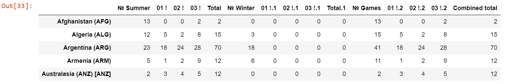
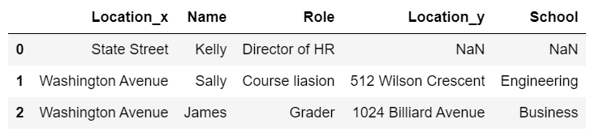

# Introduction to Data Science in Python

## Week1 Python Fundamentals

### 1.1 Functions

```python
# All of the optional parameters, the ones that you got default values for, need to come at the end of the function declaration.
def add_number(x, y, z = None):
    if(z == None):
        return x + y
    else:
        return x + y + z
```

### 1.2 Types and Sequences

- Tuple
- List
- Dictionary (map)

```python
# tuples: immutable, iterable
a = (1, 'a', 2, 'b')

# lists: mutable, iterable
a = [1, 'a', 2, 'b']
a.append(3)
b = [2, 3]
# concat the list
a + b
# repeat the list
[1] * 3
# boolean: if the item is in the list
1 in [1, 2, 3]
# slicing: list[start:end:step], negative number is acceptable
# Notice: list[0:1] return the first item but not list[0],list[1]
x[3:]
x[-4:-1]

# string type is considered as list
firstname = 'Christopher'
lastname = 'Brooks'
name = firstname + lastname
'Chris' is in firstname
# split the string
name = 'Christopher Arthur Hansen Brooks'
firstname = name.split(' ')[0]
lastname = name.split(' ')[-1]

# dictionary(map): key:value
dic = {'x1': 'y1', 'x2': 'y2'}
# iterate the dictionary
for key in dic:
    print(dic[key])
for value in dic.items():
    print(value)
for key, value in dic.items():
    print(key)
    print(value)

# sequence (list or tuple) unpacking
# numbers of variables should be equal to the length of the sequence
x = ('Christopher', 'Brooks', 'brooksch@umich.edu')
fname, lname, email = x
```

### 1.3 More on strings

- UTF(Unicode Transformation Format): available for more language, default for Python3 to use UTF

```python
# When use print() function, the output should be string
print('Test:' + str(2))
# Python has a built in method for convenient string formatting.
sales_record = {'price': 3.24,
                'num_items': 4,
                'person': 'Chris'}
sales_statement = '{} bought {} item(s) at a price of {} each for a total of {}'
print(sales_statement.format(sales_record['person'],
                             sales_record['num_items'],
                             sales_record['price'],
                             sales_record['num_items']*sales_record['price']))
```

### 1.4 Reading and Writing CSV files

```python
# Reading data
import csv
%precision 2
with open(filename) as csvfile:
    data = list(csv.DictReader(csvfile))
# rows number of the dictionary
len(data)
# column name of the dictionary
data[0].keys()
# Example1: calculate the mean value of a column
# type(data):list, type(data[0]):OrderedDict
# Note that `r[c] for r in data` returns a generator
sum(float(r['column_name']) for r in data) / len(data)

# Example2: find out what kinds of cylinders are there in the data
cylinders = set(r['cyl'] for r in data)

# Example3: calculate the avg_mpg of each kind of cylinder and sort the result
CtyMpgByCyl = []
for c in cylinders: # iterate over all the cylinder levels
    summpg = 0
    cyltypecount = 0
    for d in mpg: # iterate over all dictionaries
        if d['cyl'] == c: # if the cylinder level type matches,
            summpg += float(d['cty']) # add the cty mpg
            cyltypecount += 1 # increment the count
    CtyMpgByCyl.append((c, summpg / cyltypecount)) # append the tuple ('cylinder', 'avg mpg')
CtyMpgByCyl.sort(key=lambda x: x[0])
```

### 1.5 Dates and Times

- epoch: January 1, 1970, the most common legacy methods for storing the date and time in online transactions systems

```python
import datetime as dt
import time as tm

# get the current time
# tm.time() returns a timestamp
dtnow = dt.datetime.fromtimestamp(tm.time())

dtnow.year, dtnow.month, dtnow.day, dtnow.hour, dtnow.minute, dtnow.second # get year, month, day, etc.from a datetime

delta = dt.timedelta(days = 100) # create a timedelta of 100 days
today = dt.date.today()
today - delta # the date 100 days ago
today > today-delta # compare dates
```

### 1.6 Objects and map()

- Classes in Python are generally named using camel case, which means the first character of each word is capitalized
- To have access to the instance which a method is being invoked upon, you must include self in the method signature. (self指的是类实例对象本身)
- Objects in Python do not have private or protected members
- There's no need for an explicit constructor when creating objects in Python. You can add a constructor if you want to by declaring the `__init__` method
- Functional programming is a programming paradigm in which you explicitly declare all parameters which could change through execution of a given function

```python
# Example of object in Python
class Person:
    department = 'School of Information' #a class variable
    def set_name(self, new_name): #a method
        self.name = new_name
    def set_location(self, new_location):
        self.location = new_location
person = Person()
person.set_name('Christopher Brooks')
person.set_location('Ann Arbor, MI, USA')
print('{} live in {} and works in the department {}'.format(person.name, person.location, person.department))

# Example of map() function
# map(function, interable,...)
store1 = [10.00, 11.00, 12.34, 2.34]
store2 = [9.00, 11.10, 12.34, 2.01]
cheapest = map(min, store1, store2) # returns a map object
for item in cheapest:
    print(item)
```

### 1.7 Lambda and List Comprehensions

- Lambda's are Python's way of creating anonymous functions

```python
# Example of Lambda function
my_function = lambda a, b, c : a + b
# type(my_function): function, contains only one line
my_function(1, 2, 3)

# Example of list comprehensions
my_list = [number for number in range(0,1000) if number % 2 == 0]

lowercase = 'abcdefghijklmnopqrstuvwxyz'
digits = '0123456789'
id_num = [a+b+c+d for a in lowercase for b in lowercase for c in digits for d in digits]
```

### 1.8 The Numerical Python Library (NumPy)

```python
# Similar to MATLAB
import numpy as np

# Creating arrays from list
mylist = [1, 2, 3]
x = np.array(mylist) # or np.array([1, 2, 3])

# Creating matrix (multiple dimension arrays)
y = np.array([4, 5, 6])
m = np.array(x, y)
m.shape

# Creating arrays with given interval and reshaping arrays
n = np.arange(0, 30, 2) # start at 0 count up by 2, stop before 30
n = n.reshape(3, 5) # reshape array to be 3x5

# Creating arrays with given start point, end point and numbers of values
o = np.linspace(0, 4, 9) # return 9 evenly spaced values from 0 to 4
o.resize(3, 3)

# Special matrix
np.ones((3,2))
np.zeros((2,3))
np.eyes(3)
np.diag(y)

# Creating matrix with repeated array
np.array([1, 2, 3] * 2) # [1,2,3,1,2,3]
np.repeat([1, 2, 3], 2) # [1,1,2,2,3,3]

p = np.ones([2, 3], int)
# Use vstack to stack arrays in sequence vertically (row wise).
np.vstack([p, 2*p])
# Use hstack to stack arrays in sequence horizontally (column wise)
np.hstack([p, 2*p])

# operations: +,-,*,/,**,dot(),T

# check the type of an array and change the type
z.dtype
z = z.astype('f')

# useful function: max(), min(), sum(), mean(), std()
a = np.array([-3,-1,4])
# argmax and argmin return the index of the maximum and minimum values in the array.
a.argmax()
a.argmin()

# Slicing (similar to list)
# array[start:stop:stepsize]

r = np.arange(36)
r.resize((6,6))
r(r>30) = 30 # logical indexing

# Notice that the index and the array name is like a pointer. The following code will change the original array
r2 = r[:3,:3]
r2[:] = 0
r3 = r
r3[0,0] = 0
# use r.copy to create a copy to avoid this
r_copy = r.copy()

# Iterating Over Arrays
test = np.random.randint(0, 10, (4,3))
for row in test:
    print(row)
for i in range(len(test)):
    print(test[i])
for i, row in enumerate(test):
    print('row', i, 'is', row)

# Use zip to iterate over multiple iterables.
test2 = test**2
for i, j in zip(test, test2):
    print(i,'+',j,'=',i+j)
```

## Week2 Basic Data Processing with Pandas

Some resourse:

- Python for Data Analysis
- Leaning the Pandas Library by Matt Harrison
- Data Skeptic
- planetpython.org

### 2.1 The Series Data Structure

```python
import pandas as pd
animals = ['Tiger', 'Bear', 'Moose']
pd.Series(animals) # stored as ndarray

import numpy as np
np.nan == None # False
np.nan == np.nan # False
np.isnan(np.nan) # True

# Create series with dictionary
sports = {'Archery': 'Bhutan',
          'Golf': 'Scotland',
          'Sumo': 'Japan',
          'Taekwondo': 'South Korea'}
s = pd.Series(sports)
s.index # key
s = pd.Series(['Tiger', 'Bear', 'Moose'], index=['India', 'America', 'Canada'])

# When the items are not aligned
sports = {'Archery': 'Bhutan',
          'Golf': 'Scotland',
          'Sumo': 'Japan',
          'Taekwondo': 'South Korea'}
s = pd.Series(sports, index=['Golf', 'Sumo', 'Hockey'])
# only stored the value that has key
# the key which has no value will be filled with NaN
```

### 2.2 Querying a Series

```python
sports = {'Archery': 'Bhutan',
          'Golf': 'Scotland',
          'Sumo': 'Japan',
          'Taekwondo': 'South Korea'}
s = pd.Series(sports)
# Query with integer location
s.iloc[3]
# Query with label
s.loc['Golf']

# Vertorization Programming
import numpy as np
total = np.sum(s)

#this creates a big series of random numbers
s = pd.Series(np.random.randint(0,1000,10000))

# Compare with the traditional method
%%timeit -n 100
summary = 0
for item in s:
    summary+=item
%%timeit -n 100
summary = np.sum(s)

# Broadcasting
s+=2
# Traditional method
for label, value in s.iteritems():
    s.set_value(label, value+2)

# adding series data
s = pd.Series([1, 2, 3])
s.loc['Animal'] = 'Bears'

original_sports = pd.Series({'Archery': 'Bhutan',
                             'Golf': 'Scotland',
                             'Sumo': 'Japan',
                             'Taekwondo': 'South Korea'})
cricket_loving_countries = pd.Series(['Australia',
                                      'Barbados',
                                      'Pakistan',
                                      'England'],
                                   index=['Cricket',
                                          'Cricket',
                                          'Cricket',
                                          'Cricket'])
all_countries = original_sports.append(cricket_loving_countries)
```

### 2.3 DataFrame

```python
# Creating dataframe with seires
purchase_1 = pd.Series({'Name': 'Chris',
                        'Item Purchased': 'Dog Food',
                        'Cost': 22.50})
purchase_2 = pd.Series({'Name': 'Kevyn',
                        'Item Purchased': 'Kitty Litter',
                        'Cost': 2.50})
purchase_3 = pd.Series({'Name': 'Vinod',
                        'Item Purchased': 'Bird Seed',
                        'Cost': 5.00})
df = pd.DataFrame([purchase_1, purchase_2, purchase_3], index=['Store 1', 'Store 1', 'Store 2'])

# Indexing
type(df.loc['Store 2']) # series when only 1 row, dataframe o.w.

df.loc['Store 1', 'Cost']
df['Cost']

# Chain operator
# Chaining tends to cause Pandas to return a copy of the DataFrame instead of a view on the DataFrame
df.loc['Store 1']['Cost']

# use this instead
df.loc[:,['Cost']]

# Drop data
# returns a copy(inplace=False)
# default: axis=0, inplace=False
df.drop('Store 1')
del copy_df['Name']
```

### 2.4 DataFrame Indexing and Loading

```python
# Indexing
# default: returns a "pointer"
costs = df['Cost']
costs+=2 # this will change the original df

# Reading external files
!cat olympics.csv # shell command, have a look at the data
df = pd.read_csv('olympics.csv', index_col = 0, skiprows=1)
df.head()
```



```python
for col in df.columns:
    if col[:2]=='01':
        df.rename(columns={col:'Gold' + col[4:]}, inplace=True)
    if col[:2]=='02':
        df.rename(columns={col:'Silver' + col[4:]}, inplace=True)
    if col[:2]=='03':
        df.rename(columns={col:'Bronze' + col[4:]}, inplace=True)
    if col[:1]=='№':
        df.rename(columns={col:'#' + col[1:]}, inplace=True)

df.head()
```

### 2.5 Querying a DataFrame

```python
# Boolean masking
only_gold = df.where(df['Gold'] > 0) # return same shape
only_gold['Gold'].count() # 100
df['Gold'].count() # 147

# without NaN
only_gold = only_gold.dropna()

# Logical operator
df[(df['Gold.1'] > 0) & (df['Gold'] == 0)]
```

### 2.6 Indexing DataFrames

- Multi-level: Inside of the index, each column is called a level and the outermost column is level zero

```python
# Set the index
# Note: Set index is a destructive process
df['country'] = df.index
df = df.set_index('Gold')

# Reset the index
df = df.reset_index()

# Multi-level index
df['SUMLEV'].unique() # returns all different values
columns_to_keep = ['STNAME',
                   'CTYNAME',
                   'BIRTHS2010',
                   'BIRTHS2011',
                   'BIRTHS2012',
                   'BIRTHS2013',
                   'BIRTHS2014',
                   'BIRTHS2015',
                   'POPESTIMATE2010',
                   'POPESTIMATE2011',
                   'POPESTIMATE2012',
                   'POPESTIMATE2013',
                   'POPESTIMATE2014',
                   'POPESTIMATE2015']
df = df[columns_to_keep]
df = df.set_index(['STNAME', 'CTYNAME']) # multi-index
df.loc[ [('Michigan', 'Washtenaw County'),
         ('Michigan', 'Wayne County')] ] # tuples

# another example
df = df.set_index([df.index, 'Name'])
df.index.names = ['Location', 'Name']
df = df.append(pd.Series(data={'Cost': 3.00, 'Item Purchased': 'Kitty Food'}, name=('Store 2', 'Kevyn')))
```

### 2.7 Missing Values

`df.fillna()`: value=None, method=''

`method='ffill'`: forward filling, fill with the former one

`method='bfill'`: backward filling

```python
df = df.fillna(method='ffill')
df.head()
```

### 2.8 Assignment 2

- `series.idxmax()`: 返回series最大值对应的index
- `df.groupby()`: 返回一个DataFrameGroupBy object, 相当于先将df对某个标签分类，对每个标签使用相同的函数并按这个标签返回结果
- `sort_value(by='', ascending=True)`: 注意升序和降序排列
- `df[((df['col1']==cond1) | (df['col2']==cond2)) & (df['col3']==cond3)]`: 注意运算符优先级

```python

```

## Week3 Advanced Python Pandas

### 3.1 Merging Dataframes

Similar to SQL, always be aware that the two dataframe can't change the order.

```python
import pandas as pd

df = pd.DataFrame([{'Name': 'Chris', 'Item Purchased': 'Sponge', 'Cost': 22.50},
                   {'Name': 'Kevyn', 'Item Purchased': 'Kitty Litter', 'Cost': 2.50},
                   {'Name': 'Filip', 'Item Purchased': 'Spoon', 'Cost': 5.00}],
                  index=['Store 1', 'Store 1', 'Store 2'])
df['Date'] = ['December 1', 'January 1', 'mid-May']
df['Delivered'] = True
df['Feedback'] = ['Positive', None, 'Negative']
adf = df.reset_index()
# row 2 gets NaN
adf['Date'] = pd.Series({0: 'December 1', 2: 'mid-May'})

# Merge
staff_df = pd.DataFrame([{'Name': 'Kelly', 'Role': 'Director of HR'},
                         {'Name': 'Sally', 'Role': 'Course liasion'},
                         {'Name': 'James', 'Role': 'Grader'}])
staff_df = staff_df.set_index('Name')
student_df = pd.DataFrame([{'Name': 'James', 'School': 'Business'},
                           {'Name': 'Mike', 'School': 'Law'},
                           {'Name': 'Sally', 'School': 'Engineering'}])
student_df = student_df.set_index('Name')

pd.merge(staff_df, student_df, how='outer', left_index=True, right_index=True) # union
pd.merge(staff_df, student_df, how='inner', left_index=True, right_index=True) # intersection
pd.merge(staff_df, student_df, how='left', left_index=True, right_index=True) # drop NaN in left_df
pd.merge(staff_df, student_df, how='right', left_index=True, right_index=True) # drop NaN in right_df

# Merging with column
staff_df = staff_df.reset_index()
student_df = student_df.reset_index()
pd.merge(staff_df, student_df, how='left', left_on='Name', right_on='Name')

# Merge when there are conflics
staff_df = pd.DataFrame([{'Name': 'Kelly', 'Role': 'Director of HR', 'Location': 'State Street'},
                         {'Name': 'Sally', 'Role': 'Course liasion', 'Location': 'Washington Avenue'},
                         {'Name': 'James', 'Role': 'Grader', 'Location': 'Washington Avenue'}])
student_df = pd.DataFrame([{'Name': 'James', 'School': 'Business', 'Location': '1024 Billiard Avenue'},
                           {'Name': 'Mike', 'School': 'Law', 'Location': 'Fraternity House #22'},
                           {'Name': 'Sally', 'School': 'Engineering', 'Location': '512 Wilson Crescent'}])
pd.merge(staff_df, student_df, how='left', left_on='Name', right_on='Name')
# _x is left_df information and _y is right_df information
# MultiIndex is also acceptable
```



### 3.2 Pandas Idioms

Method chaining, also known as named parameter idiom, is a common syntax for invoking multiple method calls in object-oriented programming languages. Each method returns an object, allowing the calls to be chained together in a single statement without requiring variables to store the intermediate results.

Local variable declarations are syntactic sugar because of the difficulty humans have with deeply nested method calls.

A method chain is also known as a train wreck due to the increase in the number of methods that come one after another in the same line that occurs as more methods are chained together even though line breaks are often added between methods.

```python
# using parentheses to run multiple lines
(df.where(df['SUMLEV']==50)
    .dropna()
    .set_index(['STNAME','CTYNAME'])
    .rename(columns={'ESTIMATESBASE2010': 'Estimates Base 2010'}))

(df.drop(df[df['Quantity'] == 0].index)
    .rename(columns={'Weight': 'Weight (oz.)'}))
```

`applymap()` return the result of each element in the DataFrame

`apply()` return the result of each row in the DataFrame

```python
import numpy as np
def min_max(row):
    data = row[['POPESTIMATE2010',
                'POPESTIMATE2011',
                'POPESTIMATE2012',
                'POPESTIMATE2013',
                'POPESTIMATE2014',
                'POPESTIMATE2015']]
    return pd.Series({'min': np.min(data), 'max': np.max(data)})
df.apply(min_max, axis=1)

# lambda function
df.apply(lambda x: np.max(x[rows]), axis=1)
```

### 3.3 Group by

`df.groupby()` returns a iterable `GroupBy` object. The first one is the index of group and the second one is the dataframe.

e.g. `for group, frame in df.groupby('colname'):` notice that we can set multiple column names to seperate groups.

For more details: https://pandas.pydata.org/pandas-docs/stable/reference/groupby.html

```python
# using unique function
for state in df['STNAME'].unique():
    avg = np.average(df.where(df['STNAME']==state).dropna()['CENSUS2010POP'])
    print('Counties in state ' + state + ' have an average population of ' + str(avg))

# using groupby function(!this is way faster than the above one)
for group, frame in df.groupby('STNAME'):
    avg = np.average(frame['CENSUS2010POP'])
    print('Counties in state ' + group + ' have an average population of ' + str(avg))
```

`df.groupby()` also accept function name.

```python
# another way to use groupby(using function)
df = df.set_index('STNAME')
def fun(item):
    if item[0]<'M':
        return 0
    if item[0]<'Q':
        return 1
    return 2
for group, frame in df.groupby(fun):
    print('There are ' + str(len(frame)) + ' records in group ' + str(group) + ' for processing.')
```

`GroupBy.agg()` and `GroupBy.apply()` Apply function func group-wise and combine the results together.

```python
# (split apply combine pattern)
# agg() is an apply function
df.groupby('STNAME').agg({'CENSUS2010POP': np.average})

# apply()
df.groupby('Category').apply(lambda df,a,b: sum(df[a] * df[b]), 'Weight (oz.)', 'Quantity')

# differences between series and dataframe when using groupby object
# be aware of the index

(df.set_index('STNAME').groupby(level=0)['POPESTIMATE2010','POPESTIMATE2011'].agg({'avg': np.average, 'sum': np.sum}))

(df.set_index('STNAME').groupby(level=0)['POPESTIMATE2010','POPESTIMATE2011'].agg({'POPESTIMATE2010': np.average, 'POPESTIMATE2011': np.sum}))
```

### 3.4 Pivot Tables

`df.pivot_table(values='(kW)', index='YEAR', columns='Make', aggfunc=np.mean)` Create a spreadsheet-style pivot table as a DataFrame. Here `aggfunc` can accept multiple functions and "leftjoin" to the dataframe.

### 3.5 Date Functionality

`pd.Timestamp('9/1/2016 10:05AM')` returns a `Timstamp` object with format 'YYYY-MM-DD HH:MM:SS'

`pd.Period('1/2016')` returns a `Period` object with format 'YYYY-MM', 'M'; 'YYYY-MM-DD', 'D' etc.

If we set the index of a dataframe with `Timestamp` object, it converts to `DatetimeIndex`. If we set it with `Period` object, it converts to `PeriodIndex`

`pd.to_datatime()` converts common date string/list to `Datetime` object

Substracting two `Timestamp` objects returns `Timedeltas` object

`pd.date_range('10-01-2016', periods=9, freq='2W-SUN')` returns 9 `DatetimeIndex` objects which are Sundays with 2 weeks interval starting from 10-01-2016.

`DatetimeIndex.weekday_name` returns the name of the day.

`df.resample('M').mean()` resample `DatetimeIndex` in month and fill with the mean value

`df.asfreq('W', method='ffill')` resample `DatetimeIndex` in week and fill with the former value

## Week4 Statistical Analysis in Python and Project

### 4.1 Distribution

`np.random.binomial(n,p,size)` create a list of counts of success outcomes.

`np.random.normal(mu,sigma,size)` normal distribution

`np.std(list)` standard deviation

`stats.kurtosis(list)` calculate kurtosis

(峰度，表征概率密度分布曲线在平均值处峰值高低的特征数。直观看来，峰度反映了峰部的尖度。样本的峰度是和正态分布相比较而言统计量，如果峰度大于3，峰的形状比较尖，比正态分布峰要陡峭。反之亦然。)

$$
\begin{aligned}
    Kurt &= E[(\frac{X-\mu}{\sigma})^4]\\
    &=\frac{E[(X-\mu)^4]}{\sigma^4}\\
    &= \frac{\mu_4}{n\sigma^4}
\end{aligned}
$$

`stats.skew(list)` calculate skewness

偏态量度对称性。0说明是最完美的对称性，正态分布的偏态就是0。如图2所示，右偏态为正，表明平均值大于中位数。反之为左偏态，为负。

$$
\begin{aligned}
    Skew &= E[(\frac{X-\mu}{\sigma})^3]\\
    &=\frac{E[(X-\mu)^3]}{\sigma^3}
\end{aligned}
$$

### 4.2 Hypothesis Testing

`stats.ttest_ind(list1,list2)` two-sample mean t-test